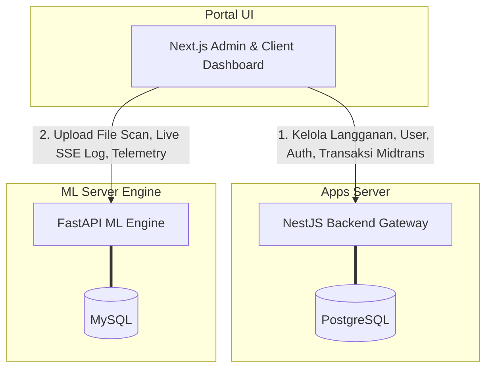

# 🛡️ MangoDefend - Malware Detection Ecosystem

> **Sistem Antivirus & Deteksi Malware Terintegrasi Berbasis Machine Learning (ML), NestJS Core Backend, dan Next.js Admin Dashboard**

Selamat datang di repositori utama **MangoDefend**. Repositori ini mengintegrasikan seluruh komponen sistem pendeteksian malware berbasis visualisasi grayscale file biner dan klasifikasi menggunakan model jaringan saraf tiruan (neural network) berformat ONNX.

---

## 🏗️ 1. Peta Proyek & Sub-Project

Proyek ini terbagi menjadi 3 repositori/folder utama yang bekerja secara sinergis:

```text
mangodefend/
├── 🐍 mangodefend-ml-server/    # Engine Deteksi Utama (Python FastAPI + ONNX Runtime)
├── 🟢 mangodefend-apps-server/  # Core Backend & Gateway (NestJS + PostgreSQL + Midtrans)
└── 🖥️ admin/                    # Antarmuka Dashboard Admin & Klien (Next.js + TSX + Tailwind)
```

| Folder                        | Deskripsi                                                                                     | Tech Stack                               | Dokumentasi Detail                                                                                                                      |
| :---------------------------- | :-------------------------------------------------------------------------------------------- | :--------------------------------------- | :-------------------------------------------------------------------------------------------------------------------------------------- |
| **`mangodefend-ml-server`**   | API deteksi malware, konverter grayscale, inferensi model ML, SSE log streaming.              | FastAPI, ONNX, OpenCV, MySQL, Locust     | [Manual Book](file:///home/mr-pacman/Documents/Project%20Deteksi%20Malware%20Magang/mangodefend/mangodefend-ml-server/MANUAL_BOOK.md)   |
| **`mangodefend-apps-server`** | Otentikasi JWT, limit kuota scan harian, payment gateway Midtrans, database core.             | NestJS, TypeORM, PostgreSQL, Firebase    | [Manual Book](file:///home/mr-pacman/Documents/Project%20Deteksi%20Malware%20Magang/mangodefend/mangodefend-apps-server/MANUAL_BOOK.md) |
| **`admin`**                   | Dashboard interaktif, manajemen user, log telemetry real-time, invoice, portal plan checkout. | Next.js, React, Tailwind CSS v4, Zustand | [Manual Book](file:///home/mr-pacman/Documents/Project%20Deteksi%20Malware%20Magang/mangodefend/admin/MANUAL_BOOK.md)                   |

---

## 📡 2. Diagram Arsitektur & Alur Kerja

Alur data utama dan hubungan antar service:



---

## ⚡ 3. Cara Menjalankan Semua Service (Development Mode)

Untuk menjalankan seluruh ekosistem MangoDefend secara lokal, buka 3 tab terminal terpisah:

### 🚀 Jendela 1: Python ML Server

```bash
cd mangodefend-ml-server
source .venv/bin/activate
pip install -r requirements.txt
uvicorn main:app --reload --port 8000
```

### 🚀 Jendela 2: Core Apps Server

```bash
cd mangodefend-apps-server
npm install
npm run start:dev
```

### 🚀 Jendela 3: Admin & Client Dashboard

```bash
cd admin
pnpm install # atau npm install
pnpm dev
```

---
