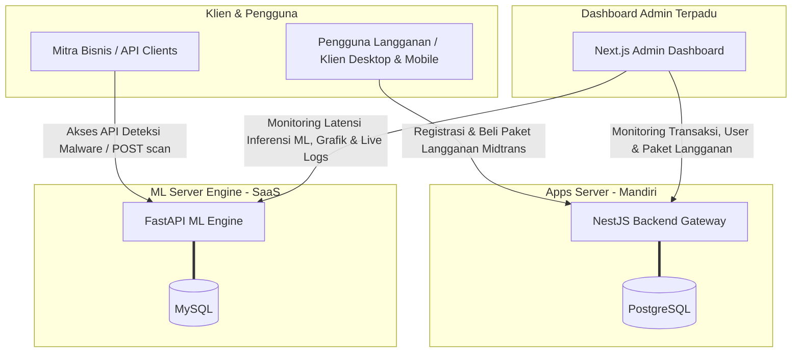

# 🛡️ MangoDefend - Malware Detection Ecosystem

> **Sistem Antivirus & Deteksi Malware Terintegrasi Berbasis Machine Learning (ML), NestJS Core Backend, dan Next.js Admin Dashboard**

Selamat datang di repositori utama **MangoDefend**. Repositori ini mengintegrasikan seluruh komponen sistem pendeteksian malware berbasis visualisasi grayscale file biner dan klasifikasi menggunakan model jaringan saraf tiruan (neural network) berformat ONNX.

---

## 🏗️ 1. Peta Proyek & Sub-Project

Proyek ini terbagi menjadi 3 repositori/folder utama yang dioperasikan secara mandiri dan dimonitor secara tersentralisasi:

```text
mangodefend/
├── 🐍 mangodefend-ml-server/    # Engine Deteksi & SaaS ML API (Python FastAPI + ONNX Runtime)
├── 🟢 mangodefend-apps-server/  # Core Backend Transaksi & Langganan (NestJS + PostgreSQL + Midtrans)
└── 🖥️ admin/                    # Antarmuka Dashboard Admin Terpadu (Next.js + TSX + Tailwind)
```

| Folder                        | Deskripsi                                                                                                                                                    | Tech Stack                            |
| :---------------------------- | :----------------------------------------------------------------------------------------------------------------------------------------------------------- | :------------------------------------ |
| **`mangodefend-ml-server`**   | Platform **SaaS ML** bagi **Mitra** untuk mengakses API deteksi malware, konversi grayscale, inferensi model ML, dan SSE log streaming.                      | FastAPI, ONNX, OpenCV, MySQL, Locust  |
| **`mangodefend-apps-server`** | Backend mandiri khusus untuk mengelola akun **User**, transaksi pembayaran (Midtrans), dan paket langganan antivirus.                                        | NestJS, TypeORM, PostgreSQL, Firebase |
| **`admin`**                   | Dashboard interaktif terpadu untuk memantau performa kedua server secara bersamaan (manajemen user/transaksi dari Apps Server & metrik/logs dari ML Server). | Next.js, React, Tailwind CSS, Zustand |

---

## 📡 2. Diagram Arsitektur & Alur Kerja

Berikut adalah visualisasi hubungan sistem di mana kedua backend server berdiri sendiri secara terpisah dan di-monitoring di dalam satu dashboard admin:



---

## ⚡ 3. Cara Menjalankan Semua Service (Development Mode)

Untuk menjalankan seluruh ekosistem MangoDefend secara lokal, buka 3 tab terminal terpisah:

### 🚀 Jendela 1: Python ML Server (SaaS Engine)

```bash
cd mangodefend-ml-server
source .venv/bin/activate
pip install -r requirements.txt
uvicorn main:app --reload --port 8000
```

### 🚀 Jendela 2: Core Apps Server (Langganan & Transaksi)

```bash
cd mangodefend-apps-server
npm install
npm run start:dev
```

### 🚀 Jendela 3: Admin Dashboard (Monitoring Terpadu)

```bash
cd admin
pnpm install
pnpm dev
```
