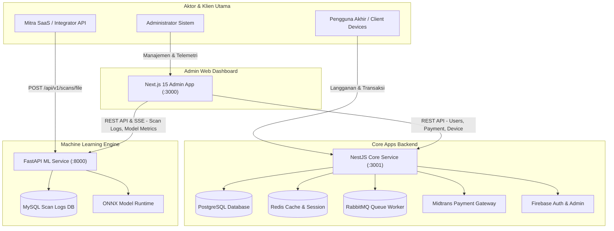

# 🛡️ MangoDefend - Monorepo Malware Detection Ecosystem

[](https://opensource.org/licenses/MIT)
[](https://nestjs.com/)
[](https://fastapi.tiangolo.com/)
[](https://nextjs.org/)
[](https://onnxruntime.ai/)
[](https://www.postgresql.org/)

Ekosistem keamanan siber terpadu untuk deteksi malware berbasis **Machine Learning (ONNX)**, visualisasi biner grayscale, backend transaksional berkinerja tinggi, dan **Dashboard Monitoring Terpadu**.

---

## 📌 Daftar Isi

- [Arsitektur Ekosistem](#-arsitektur-ekosistem)
- [Komponen Utama](#-komponen-utama)
- [Persyaratan Sistem](#-persyaratan-sistem)
- [Panduan Instalasi & Quickstart](#-panduan-instalasi--quickstart)
- [Konfigurasi Lingkungan (.env)](#-konfigurasi-lingkungan-env)
- [Struktur Monorepo](#-struktur-monorepo)
- [Dokumentasi API & Fitur](#-dokumentasi-api--fitur)
- [Lisensi](#-lisensi)

---

## 🏗️ Arsitektur Ekosistem

MangoDefend memisahkan layanan menjadi microservices terisolasi untuk menjamin keandalan, skalabilitas, dan pemisahan beban kerja (seperti proses inferensi ML yang beresiko beban CPU/GPU tinggi).



---

## 🧩 Komponen Utama

### 1. 🟢 `mangodefend-apps-server` (Core Backend Service)
Backend terpusat yang dibangun menggunakan **NestJS**, **TypeORM**, **PostgreSQL**, **Redis**, dan **RabbitMQ**.
- **Fungsi Utama**: Otentikasi pengguna (Firebase/JWT), transaksi & gateway pembayaran (Midtrans), manajemen langganan (Subscription Plans), perizinan perangkat (Devices), antrean asynchronous worker, dan pengiriman notifikasi/email.
- **Port Default**: `3001` (atau dikonfigurasi via `.env`)

### 2. 🐍 `mangodefend-ml-server` (SaaS Machine Learning Engine)
Mesin deteksi berbasis **Python FastAPI** dan **ONNX Runtime**.
- **Fungsi Utama**: Mengubah file biner/aplikasi yang di-upload menjadi visualisasi gambar grayscale (2D array), kemudian mengklasifikasikannya menggunakan model deep learning (CNN ONNX). Hasil pemindaian dan log real-time disimpan di **MySQL** serta di-stream via **Server-Sent Events (SSE)**.
- **Port Default**: `8000`

### 3. 🖥️ `admin` (Unified Admin Dashboard)
Dashboard web interaktif yang dikembangkan dengan **Next.js 15 App Router**, **Tailwind CSS**, dan **Zustand**.
- **Fungsi Utama**: Antarmuka kontrol terpadu bagi administrator untuk mengelola akun pengguna, riwayat transaksi pembayaran, kuota pemindaian perangkat, metrik latensi ML engine, serta analisis log sistem secara real-time.
- **Port Default**: `3000`

---

## ⚙️ Persyaratan Sistem

Pastikan environment lokal Anda memiliki:
- **Node.js**: `v18.x` atau `v20.x`
- **pnpm**: `v9.x` (atau `npm`)
- **Python**: `v3.10+` (disarankan menggunakan virtualenv)
- **PostgreSQL**: `v14+`
- **MySQL**: `v8+`
- **Redis**: `v6+`
- **RabbitMQ**: `v3+`

---

## 🚀 Panduan Instalasi & Quickstart

Untuk menjalankan seluruh sistem secara lokal:

### 1. Clone Repositori
```bash
git clone https://github.com/fahdaja/mangodefend.git
cd mangodefend
```

### 2. Jalankan `mangodefend-apps-server`
```bash
cd mangodefend-apps-server
cp .env.example .env
pnpm install
pnpm run start:dev
```

### 3. Jalankan `mangodefend-ml-server`
```bash
cd ../mangodefend-ml-server
python -m venv .venv
source .venv/bin/activate  # Linux/macOS
# .venv\Scripts\activate   # Windows
pip install -r requirements.txt
uvicorn main:app --reload --port 8000
```

### 4. Jalankan `admin` Dashboard
```bash
cd ../admin
cp .env.example .env.local
pnpm install
pnpm dev
```

Akses layanan di browser Anda:
- **Admin Dashboard**: `http://localhost:3000`
- **Apps Server API**: `http://localhost:3001`
- **ML Engine API & Swagger Docs**: `http://localhost:8000/docs`

---

## 🔐 Konfigurasi Lingkungan (.env)

Setiap komponen memiliki skema file `.env` tersendiri. Rincian selengkapnya mengenai variabel lingkungan dapat dilihat pada dokumen [DOCUMENTATION.md](file:///home/mr-pacman/Documents/Project%20Deteksi%20Malware%20Magang/mangodefend/DOCUMENTATION.md).

Contoh ringkas variabel utama:
- `DATABASE_URL`: PostgreSQL connection string untuk Apps Server.
- `MYSQL_URL` / `DB_*`: MySQL connection params untuk ML Server.
- `MIDTRANS_SERVER_KEY`: Kunci API Midtrans sandbox/production.
- `REDIS_HOST` & `RABBITMQ_URL`: Alamat broker antrean dan perantara pesan.

---

## 📁 Struktur Monorepo

```text
mangodefend/
├── DOCUMENTATION.md           # Dokumentasi teknis & arsitektur lengkap
├── LICENSE                    # Lisensi terbuka MIT
├── README.md                  # Dokumentasi ringkas repositori
├── admin/                     # Dashboard Frontend (Next.js 15)
│   ├── app/                   # App Router Pages & Components
│   ├── lib/                   # API Client & State Store (Zustand)
│   └── public/                # Asset gambar & ikon UI
├── mangodefend-apps-server/   # Core Backend (NestJS Monolith Service)
│   ├── src/api/               # Modul (Auth, Users, Scans, Transactions, Subscriptions, Devices)
│   ├── src/common/            # Provider Shared (Firebase, Redis, RabbitMQ, Mail)
│   └── src/workers/           # Background Job Queue Workers
└── mangodefend-ml-server/     # ML SaaS Service (FastAPI + ONNX)
    ├── app/api/scans/         # Router, Engine Inference & Log Model
    ├── app/ml/                # File Model ONNX (Modelv2.onnx)
    └── main.py                # Entrypoint FastAPI Server
```

---

## 📖 Dokumentasi API & Fitur Lengkap

Dokumentasi lengkap mengenai detail endpoint REST API, alur transaksi pembayaran Midtrans, arsitektur background worker RabbitMQ/Redis, serta arsitektur inferensi model ONNX telah dirangkum secara mendalam di dokumen:

📄 **[Lihat DOCUMENTATION.md](file:///home/mr-pacman/Documents/Project%20Deteksi%20Malware%20Magang/mangodefend/DOCUMENTATION.md)**

---

## 📄 Lisensi

Proyek ini dilisensikan di bawah **MIT License**. Lihat file [LICENSE](file:///home/mr-pacman/Documents/Project%20Deteksi%20Malware%20Magang/mangodefend/LICENSE) untuk rincian selengkapnya.

---

<p align="center">
  Dikembangkan oleh <b>MangoDefend Team (fahdaja)</b> &copy; 2026.
</p>
